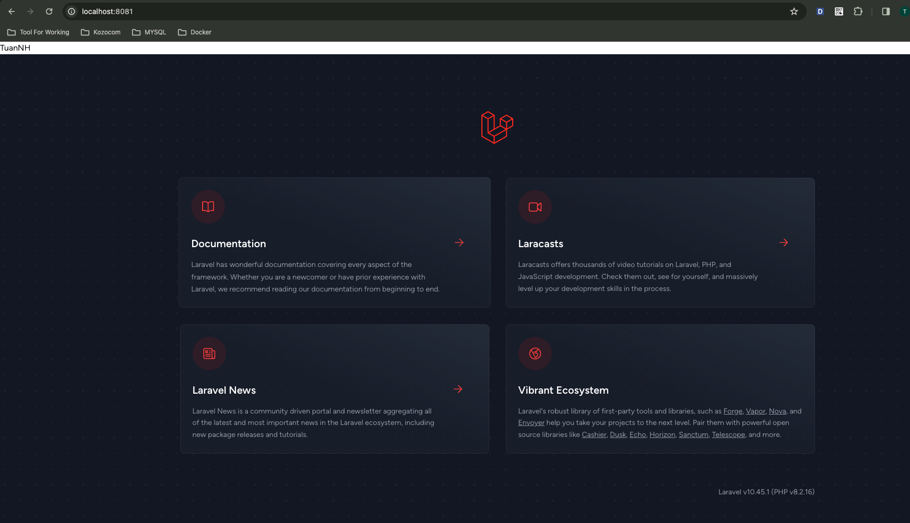
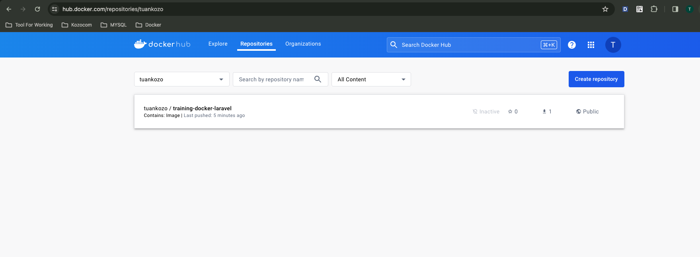

## Tạo project laravel bằng image composer
- docker run -it --rm -v $PWD:/app composer composer create-project laravel/laravel example-app

## build image Laravel 
- Config `Dockerfile`
- Đặt tên cho image: `training-docker/laravel`
  - docker build -t training-docker/laravel .
- Run container image training-docker/laravel
  - docker run -p 8080:8000 --rm training-docker/laravel
- Website laravel được hiển thị kèm với tên của mình

  

- Push image lên docker hub cá nhân
  - docker tag training-docker/laravel tuankozo/training-docker-laravel
  - docker push tuankozo/training-docker-laravel

  
